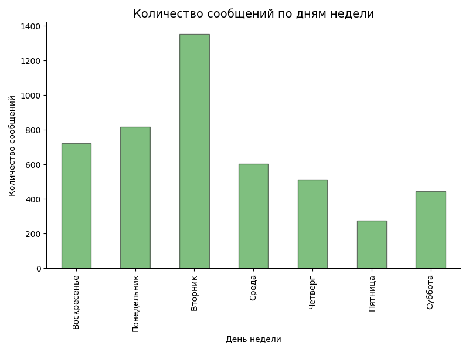
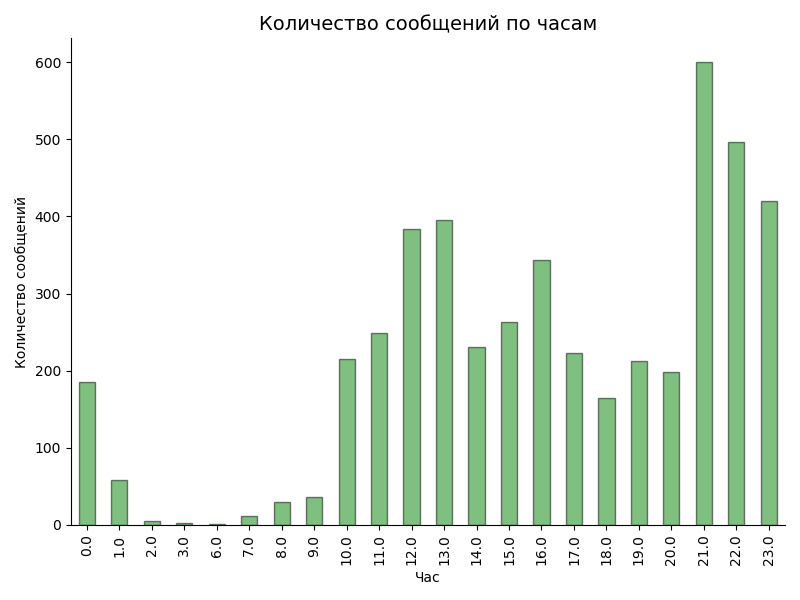
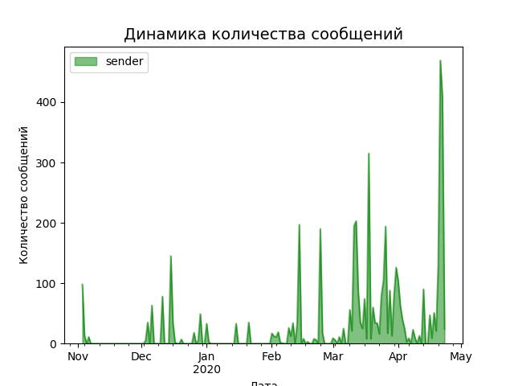

#### Telegram chats texts analysis
Usage:
```
python analyze_tg_chat.py -i ChatExport_23_04_2020 -o ./imgs
```

Results examples:
```
Первое сообщение: 2019-11-03 12:04:53
Последнее сообщение: 2020-04-23 18:07:25
Прошло полных дней: 172
Из них с сообщениями: 81
Всего написали сообщений: 4749
А это значит в среднем 28 сообщений в день
Если взять только активные дни, то в среднем 59 сообщений
Больше всего сообщений отправлено 2020-04-21 (469 сообщений)
```
 Weekdays distribution|Hour distribution|Timeline
:----------------------------:|:----------------------------:|:----------------------------:
 |  | 